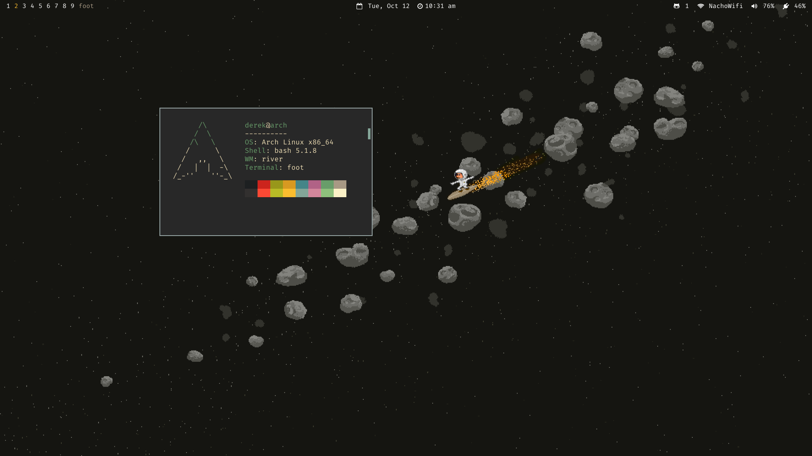

# dots

dotfiles for my comfy linux abode

## Features

- wayland apps
- terminal based workflow
- menus based on [fzf]
  - search man pages, fonts, packages installed
  - use `pacman`/`paru` to search for packages to install/remove
  - run node scripts
  - switch git branches
  - and more!

## Setup

The `setup` script is intended to be used with systems running Arch based distributions, and uses `stow` under the hood to deploy my dotfiles. It also comes with an automated AUR installer 🙂

[fzf]:https://github.com/junegunn/fzf
